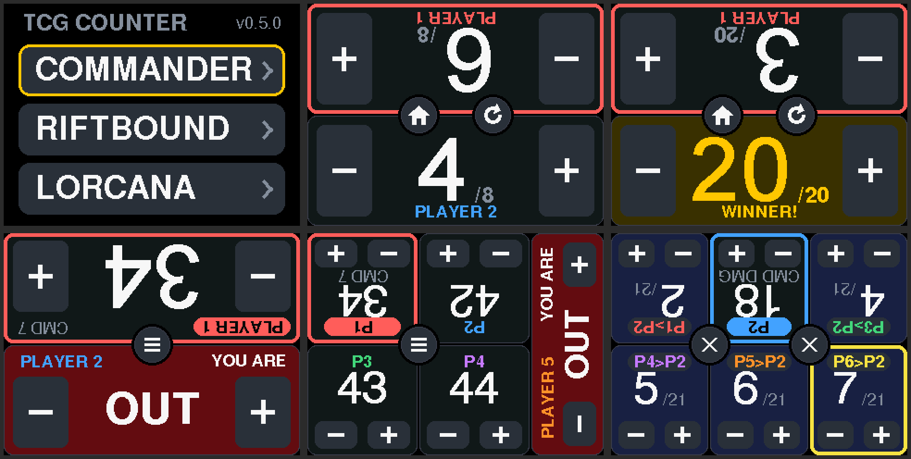

# TCG Counter — Firmware

Target: **ESP32-2432S028R "Cheap Yellow Display" (CYD)** + external **EC11 rotary encoder** with push switch.

A tabletop counter with three games on the home menu:

* **COMMANDER** — 2 to 6 players with a table layout for each count (every card faces its
  player), Lotus-style commander damage, *YOU ARE OUT*;
* **RIFTBOUND** — 2 players, first to **8** points;
* **LORCANA** — 2 players, first to **20** lore;

with touch and encoder working at the same time, and every game saved to flash so it
survives power-off.

**Build status:** compiles with zero warnings in the project code on Arduino-ESP32 core
**2.0.17** (what PlatformIO uses; tested with LovyanGFX 1.2.0 and 1.2.32) and **3.3.12**
(what the Arduino IDE installs today; tested with LovyanGFX 1.2.32). Game rules, saving,
the encoder decoder and the touch mapping of every table layout are unit-tested on a PC;
the screens are rendered off-screen from the real drawing code to check the layout. Runs on
the USB-C (ST7789) board.


*Rendered from the actual screen code at 2× scale (320×240 panel). Top: home menu,
Riftbound mid-game, Lorcana with a winner. Bottom: Commander with 2 players, 5 players (head
of table on the right, out) and 6 players in commander damage mode.*

---

## Contents

1. [Quick start](#1-quick-start)
2. [Library list](#2-library-list)
3. [Pin configuration](#3-pin-configuration)
4. [Folder and code structure](#4-folder-and-code-structure)
5. [Touch calibration](#5-touch-calibration)
6. [Changing the encoder GPIOs](#6-changing-the-encoder-gpios)
7. [Flashing the ESP32-2432S028R](#7-flashing-the-esp32-2432s028r)
8. [Adding a mode (e.g. Dice)](#8-adding-a-mode-eg-dice)
9. [First-boot hardware checklist](#9-first-boot-hardware-checklist)
10. [Troubleshooting](#10-troubleshooting)

---

## 1. Quick start

1. Edit `TCGCounter/Config.h` if needed (display driver, encoder pins), commit, push to `main`.
2. GitHub Actions builds the firmware and updates the web flasher (section 7).
3. Open the web flasher in Chrome/Edge, plug in the CYD, click the install button for your board variant (below).
4. On first boot the touch calibration runs automatically (section 5).

Building locally with PlatformIO or the Arduino IDE works too (section 7).

Using it:

| Where | Touch | Encoder |
|---|---|---|
| Home | Tap an entry to open it | Turn = move yellow focus · Press = open |
| Commander menu | **CONTINUE** = back to the running game · **2 3 4 5 6** = new game with that many players (asks first) · **HOME** | Turn = move yellow focus · Press = choose |
| Commander | Tap a card = select player · Tap/hold **−**/**+** = life (hold repeats) · **Swipe sideways on a card's number** = commander damage mode for that player · Tap centre **≡** = Commander menu | Turn = selected player's life ±1 per click · Press = next player (P1→P2→…→P1) · **Long-press** = commander damage mode for the selected player |
| Commander damage mode | −/+ on an **opponent's** card = damage that opponent dealt to the victim · −/+ on the victim's card = life · Tap centre **✕**, or swipe the victim's card again = close · Swipe another card = switch player | Turn = damage from the focused opponent · Press = next opponent · Long-press = close |
| Riftbound / Lorcana | Tap/hold **−**/**+** = score (hold repeats) · Tap a card = select · Centre **⌂** = Home · Centre **↻** = Restart (asks first) | Turn = selected player's score · Press = other player · Long-press = Restart (asks first) |

**Players and seating (2–6).** Home → **COMMANDER** opens the Commander menu. **CONTINUE**
goes back to the game in progress; a number starts a **new game** for that many players.
Because that wipes the running game it asks *NEW GAME? … CANCEL / START* first (unless
nothing has happened yet in the running game, then there is nothing to lose). The centre
**≡** in the game brings you back to this menu. Lay the device flat in the middle of the
table — every card is drawn the right way round for the player sitting at that edge:

```
 2 players            3 players            4 players
 ┌──────────────┐     ┌──────┬──────┐     ┌──────┬──────┐
 │  P1 (far)    │     │  P1  │  P2  │     │  P1  │  P2  │   far side: upside down
 ├──────≡───────┤     ├──────≡──────┤     ├──────≡──────┤
 │  P2 (near)   │     │  P3  │      │     │  P3  │  P4  │   one seat left empty
 └──────────────┘     └──────┴──────┘     └──────┴──────┘

 5 players (head of table on the right)   6 players
 ┌────┬────┬──┐                           ┌────┬────┬────┐
 │ P1 │ P2 │  │                           │ P1 │ P2 │ P3 │
 ├────≡────┤P5│  P5 is turned sideways    ├────≡────≡────┤   two ≡ buttons,
 │ P3 │ P4 │  │  for the head of table    │ P4 │ P5 │ P6 │   both the same
 └────┴────┴──┘                           └────┴────┴────┘
```

The 2-player and head-of-table cards are wide: **−** on the left, **+** on the right, the
number in between. Narrow cards shorten their labels (`P5` instead of `PLAYER 5`).
Numbering is top row, then bottom row, then the head of the table, so 2–4 players keep the
seats they always had. `COMMANDER_FACE_SEATS 0` in `Config.h` draws every card upright for
someone at the bottom edge instead.

**Commander damage (Lotus-style).** Swipe sideways on a player's card (sideways *for that
player* — the head of the table swipes along the long side of their card), or long-press the
encoder for the selected player. The table switches to *commander damage mode* for that player:
their own card keeps showing their life ("CMD DAMAGE" underneath), and **everyone else's card
turns indigo and becomes a counter**, e.g. `P2 -> P1   7 /21` = damage P2's commander has dealt
to P1 (`P2>P1` on narrow cards).
Tap −/+ on the opponent who hit you. Commander damage also costs life — +1 damage = −1 life, and
taking it back returns the life. Close with the centre **✕**, by swiping the same card again, or
just wait 10 s (`CMD_MODE_TIMEOUT_MS`). Back in the normal view a card shows **CMD n** (most
damage taken from one commander) once that player has taken any.

**YOU ARE OUT.** At **0 life or less**, or **21 commander damage from one player**, the card turns
red and shows *YOU ARE OUT*. − / + still work, so a mis-tap can be undone and the player
"revives" as soon as the numbers are legal again. (Rules live in `GameState.h`: `OUT_AT_LIFE`,
`CMD_DAMAGE_LETHAL`, `CMD_DAMAGE_AFFECTS_LIFE`.)

**Riftbound and Lorcana.** Two cards facing each other (the far player's is upside down),
each with **−** on the left, **+** on the right and the score with its target (`5 /8`,
`12 /20`). Scores stop at 0 and at the target; reaching the target turns the card gold with
**WINNER!** (− still works to fix a mis-tap). The two round buttons on the centre line are
**⌂ Home** and **↻ Restart**. Restart asks *RESTART? … CANCEL / RESTART* and then puts both
players back to 0 (no question when it is already 0 : 0). Each game keeps its own score, so
you can leave a Riftbound game, play Commander, and come back to it. The targets are
`RIFTBOUND_TARGET` and `LORCANA_TARGET` in `GameState.h`.

Dice was taken off the menu in v0.5 (section 8 says where it would go back in).

**New game / reset** only exists in the Commander menu and always goes through the
*NEW GAME?* question (CANCEL is pre-selected for the encoder). Picking the same number of
players again is how you reset a game.

---

## 2. Library list

| Library | Version | Used for | Install |
|---|---|---|---|
| **LovyanGFX** by lovyan03 | ≥ 1.2.0 | ILI9341/ST7789 display, XPT2046 touch, backlight PWM, fonts, touch calibration | PlatformIO: automatic (`lib_deps`). Arduino IDE: Library Manager → "LovyanGFX" |
| **Preferences** | bundled with the core | NVS (flash) storage of game + calibration | nothing to install |
| **Arduino-ESP32 core** | 2.0.x or 3.x | framework | PlatformIO: automatic. Arduino IDE: Boards Manager → "esp32 by Espressif Systems" |

That is the whole list. Notably **not** needed: TFT_eSPI (no editing of library
`User_Setup.h` files), XPT2046_Touchscreen, or any encoder library. LovyanGFX is
configured entirely from the project's own `Board.h`, which reads `Config.h`.

---

## 3. Pin configuration

**Every GPIO number in the project is in `TCGCounter/Config.h`.** No other file contains a pin.

| Section in `Config.h` | Pins (stock ESP32-2432S028R) |
|---|---|
| 1. Rotary encoder | `ENC_A` 35, `ENC_B` 22, `ENC_SW` 27 — **provisional, replace with yours** |
| 2. Display (HSPI) | SCLK 14, MOSI 13, MISO 12, DC 2, CS 15, RST −1 (tied to EN), backlight 21 |
| 3. Touch XPT2046 | SCLK 25, MOSI 32, MISO 39, CS 33, IRQ 36 (IRQ unused by default) |
| 4. Other on-board | SD 5/23/19/18, RGB LED 4/16/17, LDR 34, speaker 26, BOOT 0, UART 1/3 |
| 5. Behaviour | save delay, splash time, touch/encoder timings, debug log |
| 6. Pin checks | compile-time errors if an encoder pin is invalid or already used |

Also in section 2 (for other CYD revisions):

| Setting | Use when |
|---|---|
| `DISPLAY_DRIVER` = `DISPLAY_DRIVER_ST7789` | newer revisions (USB-C, or micro-USB + USB-C), or a white/garbled/mirrored screen. PlatformIO builds both: env `cyd` (ILI9341) and `cyd_st7789` |
| `DISPLAY_ROTATION` 1 ↔ 3 | UI is upside down |
| `DISPLAY_INVERT_COLORS` 1 | black background shows white |
| `DISPLAY_SWAP_RED_BLUE` 1 | the RED swatch on the boot screen is blue |
| `PIN_TFT_BACKLIGHT` | a board whose backlight is on GPIO 27 instead of 21 |

The pin check in section 6 means a bad encoder pin fails the **build** with a readable
message, for example:

```
Config.h: ENC_SW collides with a GPIO already used by CYD hardware
```

---

## 4. Folder and code structure

```
tcgcounter/
├── platformio.ini            PlatformIO project (src_dir = TCGCounter)
├── README.md
├── .github/workflows/build.yml   CI: build on push/PR, web flasher, releases on tags
├── scripts/package_firmware.sh   build output → dist/ (downloads) + site/ (web flasher)
├── flasher/index.html        web flasher page (ESP Web Tools), published to GitHub Pages
├── docs/ui_preview.png       rendered screenshots (menu + table layouts)
└── TCGCounter/               ← also the Arduino IDE sketch folder
    ├── TCGCounter.ino        setup() + the 5-call loop(). Nothing else.
    │
    ├── Config.h              ALL pins + tunables + compile-time pin checks
    ├── Board.h               LovyanGFX device built from Config.h
    ├── AppDisplay.h/.cpp     owns the LCD; boot/colour-check screen
    ├── Gfx.h                 gfx(): the canvas all screens draw on
    ├── Theme.h               colours + fonts (visual only)
    ├── Log.h                 LOGF() serial logging (DEBUG_LOG switch)
    │
    ├── InputEvents.h/.cpp    one event queue fed by both input devices
    ├── InputTouch.h/.cpp     touch polling, debounce, hold-repeat, calibration
    ├── InputEncoder.h/.cpp   encoder ISR + quadrature decoder, switch debounce
    │
    ├── GameState.h/.cpp      Screen enum, AppState, Commander rules (no drawing, no pins)
    ├── AppStorage.h/.cpp     NVS load + delayed save; calibration storage
    │
    ├── App.h/.cpp            screen state machine: routes events, triggers rendering
    ├── Screens.h             ScreenModule interface (onEnter / handleInput / render)
    ├── ScreenHome.cpp        main menu
    ├── ScreenCommanderSetup.cpp  Commander menu: continue / players 2-6 / new game (+ confirm)
    ├── CommanderLayout.h/.cpp    table layouts for 2-6 players, card geometry, touch mapping
    ├── ScreenCommander.cpp   life counter + commander damage, draws the layout's cards
    ├── ScreenScore.cpp       Riftbound + Lorcana: 2-player score race with Restart
    ├── TableDraw.h/.cpp      cards that face their player (off-screen, rotated) + round centre buttons
    ├── UiConfirm.h/.cpp      full-screen CANCEL / OK question (new game, restart)
    └── Ui.h/.cpp             shared drawing helpers + Rect hit-testing
```

### How data flows

```
 touch panel ─► updateTouch()  ─┐
                                 ├─► InputEvent queue ─► updateApplication()
 EC11 encoder ─► updateEncoder()─┘                         │  active screen's handleInput()
   (ISR counts detents)                                     ▼
                                                     g_state (GameState)
                                         ┌──────────────────┴──────────────────┐
                                         ▼                                     ▼
                                  renderIfNeeded()                     saveStateIfNeeded()
                           screen diffs state vs. what it          writes NVS ~1.5 s after the
                           last drew; repaints only changes        LAST change, changed keys only
```

Key design rules:

* **Input is device-independent.** Screens receive `InputEvent`s (`TouchDown`, `TouchRepeat`,
  `TouchSwipe`, `TouchUp`, `EncoderTurn`, `EncoderClick`, `EncoderLongPress`), never pins. Touch and
  encoder are always active together.
* **Game state knows nothing about the UI.** `GameState.cpp` has no drawing and no
  hardware calls. Screens change it through functions like `commanderAdjustLife()`.
* **Rendering is change-driven.** Each screen remembers what it last drew. A life change
  repaints one card (drawn off-screen first and turned to face its player, so no flicker);
  a selection change repaints two cards. When nothing changed, nothing is sent to the TFT.
* **Saving is change-driven too.** `AppStorage` compares `g_state` with what flash holds.
  Thirty encoder clicks in a row → one save, 1.5 s after the last click, writing only the
  keys that changed. Change-then-undo before the timer → no write at all.
* **Screens are modules.** `App.cpp` maps each `Screen` enum value to a `ScreenModule`
  (three functions). Adding a mode never touches the other screens.

### What is saved (NVS)

| Namespace | Key | Content |
|---|---|---|
| `tcg` | `ver` | schema version (mismatch → defaults, never garbage) |
| `tcg` | `np` | number of players, 2–6 (missing in saves before v0.4 → 4) |
| `tcg` | `p1`…`p6` | Commander life totals |
| `tcg` | `sel` | selected player |
| `tcg` | `scr` | last active screen (the device boots back into the game) |
| `tcg` | `rb`, `lc` | Riftbound / Lorcana: P1 score, P2 score, selected player (3 bytes each, v0.5+; missing → 0 : 0) |
| `tcg` | `cd` | commander damage, 6×6 bytes `[victim][source]` (v0.2–v0.3 saved 4×4: converted on load, the game is kept; missing in v0.1 saves → all 0) |
| `tcgtouch` | `cal`, `calv` | touch calibration (separate, so a future game reset can't erase it) |

---

## 5. Touch calibration

Calibration is required once per board (resistive panels vary). It is stored in flash
and survives normal re-uploads.

**First boot:** after the boot screen, calibration starts automatically.

1. Release the screen.
2. An arrow appears in one corner. Tap **the tip of the arrow**, precisely — a stylus, the
   back of a pen or a fingernail works best. Hold briefly until the arrow disappears.
3. Repeat for the other three corners.
4. "Calibration saved" appears, then the app starts.

**Re-calibrate any time:** reset or power the board, and while the boot screen
("TCG COUNTER / Touch & hold now to calibrate") is showing (~1.5 s), either

* touch and hold the screen anywhere, or
* press the **BOOT** button on the board.

> Press BOOT only *after* the board has started. Holding BOOT while pressing RESET puts the
> ESP32 into firmware-download mode instead.

Check it worked: open Commander and tap each − and + near their edges; the button you
touch should light up in the player's colour. With `DEBUG_LOG 1`, the serial monitor
prints `[touch] down x=… y=…` for every tap.

Calibration is erased only by a full flash erase (`pio run -t erase`, or Arduino IDE
*Tools → Erase All Flash Before Sketch Upload: Enabled*). To skip the automatic first-boot
calibration, set `TOUCH_CAL_ON_FIRST_BOOT 0`.

---

## 6. Changing the encoder GPIOs

All encoder settings are in **section 1 of `Config.h`**:

```cpp
#define ENC_ENABLED              1    // 0 = ignore the encoder completely
#define ENC_A                    35   // A / CLK
#define ENC_B                    22   // B / DT
#define ENC_SW                   27   // push switch
#define ENC_AB_INTERNAL_PULLUP   1
#define ENC_SW_INTERNAL_PULLUP   1
#define ENC_SW_ACTIVE_LOW        1
#define ENC_REVERSE              0    // 1 = swap clockwise / counter-clockwise
#define ENC_STEPS_PER_DETENT     4    // 4 (most EC11), 2, or 1
```

Steps:

1. Check your board. On a stock ESP32-2432S028R the free GPIOs are **35** (P3 connector,
   input-only, no internal pull-up), **22** (P3 and CN1) and **27** (CN1). CN1 also has
   3.3 V and GND.
2. Put your three pins into `ENC_A`, `ENC_B`, `ENC_SW`.
3. Any pin in **34–39** has no internal pull-up: give it an external **10 kΩ to 3.3 V**,
   or use an encoder module that has the resistor on that line. Prefer such a pin for
   `ENC_A`/`ENC_B`, not the switch — a floating rotation pin can't fake steps (the decoder
   rejects one-channel noise), but a floating switch pin causes phantom presses.
4. Build. If a pin is invalid, wired to flash (6–11), or already used by the CYD, the build
   stops with a message naming the pin.
5. Upload and open the serial monitor (115200). You should see:

   ```
   [encoder] A=GPIO35 B=GPIO22 SW=GPIO27, 4 steps/detent, idle AB=11
   ```

   With the knob resting on a detent, `idle AB` should be `11`. Anything else usually
   means a missing pull-up or a wiring fault. A `NOTE: … has no internal pull-up` line is a
   reminder for pins 34–39.

Wiring (EC11 common pin and one switch leg to GND):

```
EC11 A / CLK ─── ENC_A        EC11 C (middle) ─── GND
EC11 B / DT  ─── ENC_B        switch leg 1    ─── ENC_SW
                              switch leg 2    ─── GND
Module boards: + ─── 3.3 V  (never 5 V — the ESP32 is not 5 V tolerant)
```

Tuning after the first test:

| Symptom | Fix |
|---|---|
| Clockwise lowers life | `ENC_REVERSE 1` |
| One click changes life by 2 | `ENC_STEPS_PER_DETENT 4` |
| Two clicks needed per change | `ENC_STEPS_PER_DETENT 2` |
| Occasional skipped/extra steps on a cheap encoder | add 10 nF from A and B to GND (with the 10 kΩ pull-ups this forms an RC filter) |
| Button never registers | check `ENC_SW_ACTIVE_LOW` and the pull-up |

---

## 7. Flashing the ESP32-2432S028R

The CYD has a CH340 USB-serial chip. Use a **data** USB cable (many cables are charge-only).
If no serial port appears, install the CH340 driver (Windows/macOS; Linux has it built in).

### Option A — Git: push, CI builds, flash from the browser (normal workflow)

`.github/workflows/build.yml` does the building; nothing needs installing on the PC.

| You do | GitHub Actions does |
|---|---|
| push to `main` | builds with PlatformIO, stores the firmware as a build artifact, updates the web flasher |
| open a pull request | builds only, so compile errors show up before merging |
| push a tag `vX.Y.Z` | builds and creates a GitHub Release with the firmware files (the tag must equal `FW_VERSION` in `Config.h`, otherwise the build stops) |
| *Actions → Build & publish firmware → Run workflow* | a manual build |

**One-time setup** in the GitHub repo: *Settings → Pages → Build and deployment → Source:
**GitHub Actions***. The flasher is then at `https://<user>.github.io/<repo>/`.

Flashing:

1. Open the web flasher in **Chrome or Edge on a computer** (Web Serial; not Safari/iOS).
2. Plug in the CYD and click the button for your board variant, then pick the CH340 port:
   * **Install · ST7789** — newer revisions (USB-C, or micro-USB + USB-C)
   * **Install · ILI9341** — original board (micro-USB only)

   Wrong variant = mirrored or sideways picture with swapped colours; just flash the other one.
   The boot log (115200 baud) prints a `controller ID` line that names the chip.
3. In the install dialog:
   * **leave "Erase device" unticked** for updates — the saved game and touch calibration are kept;
   * tick it for a clean start — the game resets and calibration runs again.
4. The page header shows the firmware version and commit, so you can see exactly which
   build you are flashing.

The flasher writes bootloader, partition table, `boot_app0` and the app at their own
offsets, the same as a PlatformIO/Arduino upload, so the NVS area (saved game +
calibration) is only cleared if you tick *Erase*.

Files without the browser: every build's *Summary* page has a **TCGCounter-firmware**
artifact (and tagged builds attach the same files to the Release). File names are the same
in every version, so unzip each new build over the old one and reuse the same command:

| File | Use |
|---|---|
| `bootloader.bin`, `partitions.bin`, `boot_app0.bin` + `st7789-app.bin` (or `ili9341-app.bin`) | **update** — keeps the saved game and calibration |
| `st7789-fresh-install.bin` (or `ili9341-…`) | **fresh install** at address `0x0` — also wipes the saved game and calibration |
| `FLASHING.txt` | version, commit and the exact esptool commands |

To build the same files locally: `pio run && bash scripts/package_firmware.sh`
(needs `pip install "esptool>=5,<6"`).

### Option B — PlatformIO on the PC (upload over USB directly)

1. Install VS Code + the PlatformIO extension.
2. *File → Open Folder* → the cloned repo. PlatformIO downloads the ESP32 platform and
   LovyanGFX automatically the first time.
3. Connect the CYD, then click **Upload** (→ in the status bar), or run:

   ```
   pio run -e cyd_st7789 -t upload      # newer USB-C boards (ST7789)
   pio run -e cyd -t upload             # original micro-USB boards (ILI9341)
   pio device monitor
   ```

### Option C — Arduino IDE 2.x

1. *Boards Manager* → install **esp32 by Espressif Systems**. If it isn't listed, add
   `https://espressif.github.io/arduino-esp32/package_esp32_index.json` under
   *File → Preferences → Additional boards manager URLs* first.
2. *Library Manager* → install **LovyanGFX** (by lovyan03).
3. *File → Open* → `TCGCounter/TCGCounter.ino` (the folder name must stay `TCGCounter`).
4. *Tools*:
   * Board: **ESP32 Dev Module**
   * Upload Speed: 921600 (use 460800 or 115200 if uploads fail)
   * Partition Scheme: Default 4MB with spiffs
   * Erase All Flash Before Sketch Upload: **Disabled** (Enabled wipes the saved game and calibration)
   * Port: the CH340 port
5. Click **Upload**. Open *Serial Monitor* at **115200** to see the logs.

### If upload fails ("Failed to connect… Wrong boot mode")

Hold **BOOT**, tap **RST**, release BOOT, then start the upload again. After uploading, tap
**RST** once to run the new firmware.

---

## 8. Adding a mode (e.g. Dice)

`SCREEN_DICE` is still reserved in the `Screen` enum (a saved Dice screen boots to Home), so
bringing Dice back is:

| Step | File | What to do |
|---|---|---|
| 1 | `GameState.h` | Add `struct DiceState` as a member of `AppState`, update `operator==`, `appStateSetDefaults()` and `appStateSanitize()` in `GameState.cpp` (and stop sending `SCREEN_DICE` to Home there). Rules such as `diceRoll()` go in `GameState.cpp` or a new `DiceGame.cpp` — no drawing there. |
| 2 | `ScreenDice.cpp` (new) | Implement `onEnter`, `handleInput`, `render` and define `const ScreenModule DiceScreen = {...};`. `ScreenScore.cpp` is the simplest template: diff-based rendering, cards via `TableDraw`, a `ConfirmDialog` for resets. |
| 3 | `Screens.h`, `App.cpp` | Declare `DiceScreen` and return it for `SCREEN_DICE` in `moduleFor()`. |
| 4 | `ScreenHome.cpp` | Add the menu entry (four entries need `ITEM_H` / `ITEM_PITCH` re-spaced to fit 240 px). |
| 5 | `AppStorage.cpp` | Add NVS keys for the new state in `loadState()` and `writeState()`. |

Enum values are stored in flash — add new screens at the end, never renumber.

More Commander counters (poison, energy, tax) belong in `CommanderGame` in `GameState.h` and,
on screen, in `ScreenCommander.cpp` — e.g. as another card `Role` next to the commander-damage
mode. Screens can also implement the optional `tick()` hook in `ScreenModule` for timers.

---

## 9. First-boot hardware checklist

| # | Check | If wrong |
|---|---|---|
| 1 | Boot screen text reads the right way up, landscape | `DISPLAY_ROTATION` 1 ↔ 3 |
| 2 | Background black, RED/GREEN/BLUE swatches correct | `DISPLAY_INVERT_COLORS`, `DISPLAY_SWAP_RED_BLUE` |
| 3 | Screen not white/garbled/mirrored | flash the other variant (ST7789 ↔ ILI9341) |
| 4 | Calibration completes; − / + light up exactly where tapped | re-calibrate (section 5) |
| 5 | Serial shows `idle AB=11` for the encoder | pull-ups / wiring (section 6) |
| 6 | Clockwise = +1 on the selected player | `ENC_REVERSE` |
| 7 | One click = exactly one point | `ENC_STEPS_PER_DETENT` |
| 8 | Encoder press cycles P1→P2→…→P1 through the players at the table | `ENC_SW_ACTIVE_LOW`, switch wiring |
| 9 | Change life, wait 2 s (`[storage] saved` in the log), power off/on → same totals, still in Commander | — |
| 10 | Touch and encoder used together: no missed or doubled changes | report back with the serial log |

---

## 10. Troubleshooting

| Symptom | Likely cause / fix |
|---|---|
| Backlight on, screen white | Wrong driver → `DISPLAY_DRIVER_ST7789`; or lower `DISPLAY_SPI_WRITE_HZ` to 27000000 |
| Image mirrored | Wrong driver for the panel (try the other one) |
| Touch works but is offset | Re-calibrate; tap arrow tips precisely |
| Phantom touches | Raise `TOUCH_MIN_PRESSURE` (try 3–6) |
| Centre ≡ / ⌂ / ↻ / menu entry doesn't react | Tap and release within 1.2 s — longer presses are ignored on purpose (`TOUCH_TAP_MAX_MS`) |
| Random player switching | Switch pin floating → pull-up missing |
| No serial output | Monitor at 115200; `DEBUG_LOG 1` in `Config.h` |
| Build error mentioning `Config.h` | The encoder pin check — read the message, change the pin |
| Want a fresh game | Centre ≡ → pick the number of players → START |
| Head-of-table swipe doesn't open commander damage | Swipe along the long side of that card (up/down on the screen) |
